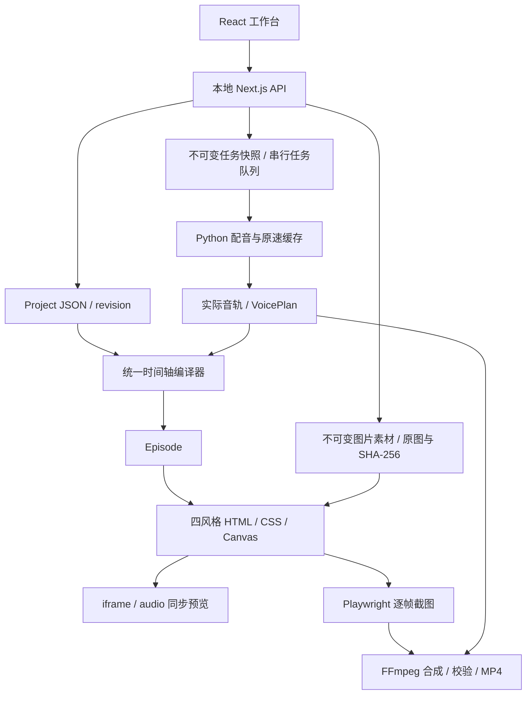

# 整合工程架构

## 边界

独立项目目录 `miyo_AI_news`。原工程 `miyo-news-card @ a11a118` 保持原样；新工程只复用复制后的源码、字体和历史材料。所有状态保存在自己的 `data/`。唯一外部运行依赖是已有 Node/Chromium/FFmpeg，以及按需使用的 Python、声线库和模型。

## 数据流



## 核心模块

- `src/core/types.ts`：项目、分镜、卡片、来源、配音计划和任务的共享契约。
- `src/core/project.ts`：校验、稳定 ID、内容/音频指纹、时间轴编译与 SRT。
- `src/core/card-layout.ts`：卡片宽高范围、不同卡位默认尺寸及历史 cardScale 兼容，UI 和渲染器共用。
- `src/server/storage.ts`：原子文件写入、项目版本冲突、样例初始化、音轨完整性和声线身份核对。
- `src/server/images.ts`：有界上传、真实格式与完整解码检查、原图保存、图片引用与完整性校验、自包含图片解析。
- `src/server/tasks.ts`：创建不可变任务快照、去重、启动本地 worker、取消标记。
- `scripts/worker.ts`：拥有任务进度、阶段和终态；同时只处理一个重任务。
- `scripts/build_voice.py`：负责完整配音事务，按语义块生成、缓存、变速、响度处理和时间计划。
- `src/engine/renderer.ts`：同一 Episode 的四种视觉适配与 iframe 消息桥。
- `scripts/render-video.ts`：逐帧绘制、编码、卡片正文布局溢出检查、音画参数校验、完整解码。
- `src/ui/Studio.tsx`：编辑草稿、保存、播放器、任务操作与结果下载。

## 时间和缓存所有权

配音计划是实际时间真相。字幕时码在 VoicePlan 中相对场景保存，由编译器累加成全局时间。卡片聚焦点以稳定 cardId 和场内进度比例保存；重排卡片不会改变其语义对应。

UI 的 audio.currentTime 驱动 iframe seek；无有效音轨时才使用估算预览时钟。iframe 嵌入模式不运行自己的播放循环，只发出 toggle/jump 并接收父窗口 seek。导出使用相同 seek 函数按 24fps 取帧。

原速 TTS 缓存指纹包含实际参考和模型身份，变速在其后处理。整期音轨复用还核对项目音频指纹、声线环境身份及 WAV SHA-256。画面变化不会让口播失效；口播文本、分镜 ID 或顺序、语速、声线变化会失效。只修改资料库原文不使音轨失效。

## 状态与恢复

```text
queued → running(voice → timeline → render → check) → succeeded
                     ├→ failed
                     └→ cancelled
```

任务创建时持久化项目快照，后续编辑不影响正在输出的版本。写项目时检查 expectedRevision，冲突返回 409；不会静默覆盖其他窗口编辑。

worker 使用带 PID 的独占锁；初始化锁与 worker 锁可以识别失效进程。子任务进程组 ID 记录在任务中。恢复中断任务时，只有进程组与项目/任务路径同时匹配才清理遗留进程；任务明确标记中断并提供重试。取消写入专用标记，运行中按阶段与短周期检查，并停止所属子进程组。

下次访问工作台、查询任务或启动 worker 时检查遗留任务。排队任务继续执行；已中断的运行任务标为 `failed / interrupted`，用户可按当前内容重试。当前没有开机守护进程，不自动续跑中断的视频。

每次输出位于独立任务目录；失败保留日志和可验证音频。最终视频通过校验后从 `.partial.mp4` 原子改名发布。下一次任务可以复用音频，视频从头渲染。

## 配图与快照

`Card.image` 只保存素材 ID、布局、填充方式和 X/Y 位置。图片元数据与原始字节位于独立 UUID 目录；上传相同文件名也不会覆盖已有素材。替换或移除卡片图片是修改引用，不修改历史素材。

上传仅接受可完整解码的静态 PNG/JPEG/WebP；同时限制实际 multipart 读取量、单文件字节和像素。保存项目时校验引用存在及整期 60 MB 上限，预览和导出解析时核对真实路径、大小与 SHA-256。图片使用浏览器展示 EXIF 方向，不重编码用户原图。

worker 从本次 `project.json` 快照解析图片，和网页预览共用 `resolveImageSources`。HTML 内嵌一份素材 ID 到 data URI 的映射，复用图片不重复保存 base64；页面等全部图片解码完成再报告 ready。图片配置只影响画面指纹，不影响音轨指纹。项目列表和时间轴轮询不重复构造图片 base64。

## 卡片尺寸与即时预览

`Card.size?` 保存 1080p 画布上的最终整数像素 `{width,height}`，宽度范围 800–1720，高度范围 360–660。未设置时由共享 `getCardSize` 按卡位返回略有不同的默认尺寸；历史 `presentation.cardScale` 只影响默认尺寸，显式尺寸不会再次缩放。编译保留 cardId 和尺寸，尺寸编辑只改变画面指纹，不改变音轨指纹。

工作台通过同源父窗口消息 `moyo:card-sizes` 批量同步稳定 sceneId/cardId 对应的尺寸。渲染器校验边界，只重新布局实际变化的卡片，并以当前时间重绘，不重建 iframe 或重载配图。保存后正常预览和任务快照通过同一配置恢复尺寸；未保存的滑杆变化不会写入项目文件。卡片舞台扩展到 y=244–936；字幕从 y=948 开始，章节从 y=1020 开始。来源、副标题和底部资料/时间文本不再生成可见节点，原始项目字段不删除。

## HTTP 与输入

接口见 [IMPLEMENTATION_CONTRACT.md](IMPLEMENTATION_CONTRACT.md)。服务监听 loopback，写操作核对请求 Host/Origin。媒体读取限定于 data 的真实路径内，支持 HTTP Range。公开网页读取仅接受公开 HTTP/HTTPS，拒绝本机和内网地址，限制重定向、响应大小与超时；不使用浏览器登录态。

手工粘贴资料和口播文本保存在项目中；网页导入保存去标签、合并空白后的提取文本，不保存原始 HTML，发布日期需人工补全。规则分镜是可编辑派生结果，UI 标为草稿；历史样例标明原日期。画面内容经过 HTML/JSON 转义。配置密钥不写入项目或客户端；目前没有接入需要 LLM key 的内容生成服务。
