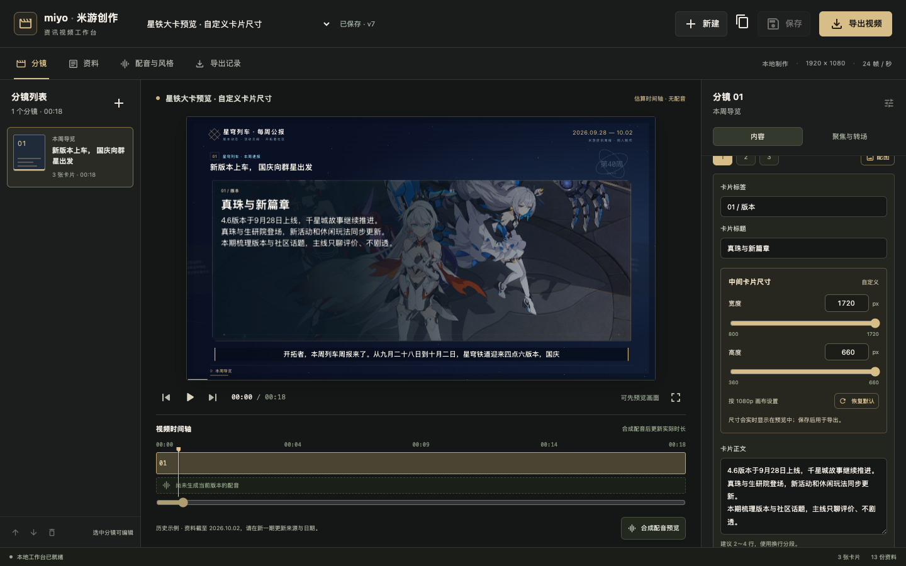

# miyo_AI_news 使用指南

本指南面向使用工作台制作米游资讯视频的人，按当前界面和代码编写，核对日期为 **2026-10-06**。原项目 `miyo-news-card` 保留，本指南介绍的是独立的 `miyo_AI_news`。

工作台把资料、分镜、卡片、手动配图、口播、配音、动画和导出放在一个项目里。一期视频对应一个项目；一个项目包含多个分镜；每个分镜有一段口播和 1–6 张卡片，按聚焦点依次居中展示。

它目前是单机制作工具。资料需要由你选取、录入和核对；「整理为分镜草稿」按段落和句子切分原文，不会自动联网搜集本周新闻，也不会自动核实或改写为成熟的新闻稿。

## 目录

- [1. 启动与界面](#1-启动与界面)
- [2. 第一次使用：先做一个短样例](#2-第一次使用先做一个短样例)
- [3. 新建、复制和切换项目](#3-新建复制和切换项目)
- [4. 导入与整理资料](#4-导入与整理资料)
- [5. 编辑分镜、卡片和口播](#5-编辑分镜卡片和口播)
- [6. 给卡片手动配图](#6-给卡片手动配图)
- [7. 独立调整中间卡片尺寸](#7-独立调整中间卡片尺寸)
- [8. 聚焦、卡片切换与章节转场](#8-聚焦卡片切换与章节转场)
- [9. 游戏风格、配音和字幕](#9-游戏风格配音和字幕)
- [10. 保存、预览与生效规则](#10-保存预览与生效规则)
- [11. 导出、取消、重试和下载](#11-导出取消重试和下载)
- [12. 日常常见问题](#12-日常常见问题)
- [13. 数量与参数速查](#13-数量与参数速查)
- [14. 文件位置与保留内容](#14-文件位置与保留内容)

## 1. 启动与界面

在终端运行：

```sh
cd /Users/shuidi/Documents/ChatGPT/AI创作/miyo_AI_news
npm run dev
```

看到服务启动后，在浏览器打开 [http://127.0.0.1:3002](http://127.0.0.1:3002)。如果服务已经运行，直接打开网页即可。制作时保持电脑和本地服务运行；网页本身刷新不会取消后台任务。

当前机器已有依赖，日常使用不需要重新安装。迁移或工具缺失时，参阅 [README](../README.md) 和 [配音说明](VOICE.md)。



图示是尺寸功能验证时的工作台，展示的是估算时间轴；具体项目的配音是否生成，以界面状态为准。

| 区域 | 用途 |
| --- | --- |
| 顶栏项目下拉框 | 切换已保存的项目；旁边显示「未保存更改」或「已保存 · v…」 |
| 顶栏「新建」、复制图标、「保存」、「导出视频」 | 创建项目、复制当前内容、保存草稿和制作成片 |
| 「分镜」页左侧 | 选择分镜，增删分镜，向前或向后排序 |
| 中间画面 | 查看当前已应用的画面、字幕和动画；支持播放、定位、全屏 |
| 中间底部时间轴 | 定位播放位置，选择某个分镜，查看是否已有配音 |
| 右侧编辑区 | 编辑选中分镜、卡片、配图、尺寸、口播及聚焦点；内容可单独滚动 |
| 「资料」页 | 录入原文、保留来源，整理为分镜草稿 |
| 「配音与风格」页 | 修改项目名称、日期、游戏风格、声线、语速、粒子和字幕字号 |
| 「导出记录」页 | 查看任务版本、进度、错误原因，取消、重试、下载 |

首次初始化会导入一份星铁历史示例，报道日期为 **2026-09-28 至 2026-10-02**。这份示例用于了解效果；制作新一期时，需要更新日期、新闻内容和来源。

## 2. 第一次使用：先做一个短样例

建议先走通「一段口播、三张卡片」的流程，再制作 3–5 分钟的整期视频。

1. 顶部点击「新建」，选择「空白项目」，填写项目名并选择游戏风格。
2. 在「分镜」页选中初始分镜，修改分镜标题和第一张卡片的标题、正文。
3. 在「画面卡片」旁点击「添加」，补成 2–3 张卡片；每张卡片放一个明确要点。
4. 在「口播稿」中写一段完整解说，使内容顺序与卡片相对应。
5. 按需要上传配图，调整布局和卡片宽高，然后点击「保存」。
6. 打开「聚焦与转场」，点击「均分重排」，再检查各聚焦点的卡片顺序。
7. 在「配音与风格」中选声线、语速；点击「试听当前分镜」听清断句与读音。
8. 点击画面下方「合成配音预览」，等整期配音完成，再播放和微调聚焦百分比。
9. 点击「导出视频」，在「导出记录」中等待「已完成」，下载视频查看。

试听只是生成选中分镜的音频。要让中间播放器使用整期的真实配音和时间轴，需要「合成配音预览」，或直接导出视频。

## 3. 新建、复制和切换项目

### 新建一期

点击顶栏「新建」，填写：

- **项目名称**：例如「星穹铁道 · 第 41 周资讯」。这也是工作台中识别该期内容的名称。
- **从哪里开始**：「空白项目」从一个分镜开始；「星铁历史周报示例 · 2026.10.02」导入历史内容供参考和编辑。
- **游戏风格**：原神、崩坏3、崩坏：星穹铁道、绝区零。

点击「创建项目」后，会进入独立的新项目。项目名称以后可以在「配音与风格」中修改。

若当前有未保存更改，创建新项目或切换项目会提示是否离开。要保留当前工作，先保存或复制，再离开。

### 在现有版本上继续探索

点击顶栏的复制图标，悬停提示为「复制当前项目（含未保存更改）」。工作台会把**当前编辑内容，包括尚未保存的项目草稿**放进新副本，名称默认追加「· 副本」，并自动切换到副本。

复制适合尝试另一种风格、调整动画或制作下一期。副本拥有独立项目编号；编辑副本不会覆盖原项目。已有图片通过素材引用继续使用，不必重新上传。新副本的导出记录独立，需要为副本创建自己的制作任务。

资料页输入框中尚未点击「加入资料库」或「更新资料」的文字，还没有进入项目草稿；要复制这些文字，先完成这一步。

### 切换和再次打开

通过顶栏下拉框切换项目。网页地址中的 `?project=项目编号` 可以直接定位到某一期；没有指定项目时，优先恢复同一浏览器上次选择的项目，再回到默认示例。

当前没有项目删除、项目历史版本回滚或通用撤销按钮。重要探索可以先复制；对尚未保存的项目草稿，可使用页面底部「放弃草稿并重新载入」，它会丢弃整份未保存草稿。

## 4. 导入与整理资料

### 读取公开网页

1. 打开「资料」页，点击左侧的新建资料图标，准备录入一份新来源。
2. 在「公开网页链接」中粘贴完整的 HTTP/HTTPS 地址。
3. 点击输入框右侧的链接图标「读取网页」。
4. 检查提取出的「资料标题」和「原文内容」；网页导航等无关文字也可能被提取。
5. 修改了这三个输入框的内容后，点击「更新资料」，再点击顶部「保存」。
6. 核对并补充「发布方」「发布日期」，选择合适的「来源状态」，完成后再次点击顶部「保存」。

网页读取不会复用浏览器登录状态，也不运行网页脚本。需要登录、依赖动态加载或读取失败的网页，直接复制可见原文粘贴导入。这里只读取文字，不会自动把网页图片加入卡片。

读取入口支持公开文字网页，不支持本机/内网地址、PDF 下载链接或直接的图片链接。网页超过 2 MB、提取原文超过 60000 字时，请选择需要的部分粘贴。

### 直接粘贴原文

1. 点击左侧「新建粘贴资料」图标。
2. 填写资料标题；有来源链接时一并填写。
3. 把内容粘贴到「原文内容」，不同选题之间留一个空行。
4. 点击「加入资料库」，再点击顶部「保存」。

修改已有资料时，先从左侧选中对应来源，再改标题、链接和原文，点击「更新资料」。**只改输入框后直接点击顶部「保存」，不会把尚未更新的这三个输入框内容写入资料库。**「整理为分镜草稿」会主动收录当前输入，因此直接整理也可以。

「来源状态」有三种：

| 状态 | 使用方式 |
| --- | --- |
| 待核实 | 刚导入、日期或内容还没有核对 |
| 已人工核实 | 你已自行核对该资料；不是工作台自动做出的事实判断 |
| 社区观点 | 玩家观点、讨论或反馈，编辑时应与官方事实区分 |

删除来源时会同时清除分镜中的来源关联，但已经写好的分镜内容会保留；删除后仍需保存。

### 整理为分镜草稿

右侧下方「整理为分镜草稿」针对**当前输入框里的这一份原文**工作，不会自动把全部资料库一起综合。

- 不勾选「替换当前全部分镜」：点击「追加为分镜」，把新草稿放到现有分镜后面。
- 勾选后：按钮变为「重新整理分镜」，确认后会替换项目中的全部分镜，包括其中原有的卡片设置。需要保留旧版时先复制项目。

整理会先保存当前项目和资料，再生成并保存新的分镜。不同段落成为不同分镜，句子被分组为卡片，原段落成为口播初稿。一次最多 20 段；一个段落超过 8000 字、需要超过 6 张卡片或导致全期超过 40 分镜时，应先拆分内容。

建议原文组织成下列形式，下面仅为结构示意：

```text
选题一的简短标题
这一条消息的事实、日期和参与条件。补充需要提醒观众的细节。

选题二的简短标题
第二条消息的原文内容。社区观点需保留其适用范围与出处。
```

整理后逐项检查标题、卡片正文和口播，去掉不适合朗读的导航、链接、重复标题等内容。现有规则整理不会自动提炼观点、核实时间或生成专业评论。

## 5. 编辑分镜、卡片和口播

### 分镜是一个讲解段落

在左侧选择一个分镜，右侧「内容」页提供：

- **分镜类型**：开场导览、资讯动态、活动与行程、社区观点、结尾备忘。
- **章节名称**：用于组织视频章节，例如「版本与活动」。
- **分镜标题**：这一段画面上的主标题。
- **栏目标签、角标**：补充简短的栏目或提示文字。
- **画面卡片**：这一段需要依次居中展示的卡片。
- **口播稿**：这一段实际合成并读出的文字。
- **关联资讯来源**：勾选该段依据的资料，方便后续核对。

当前视频画面已移除来源行、分镜副标题、底部资料截止和计时文字。来源、原有副标题及资料截止内容仍可保存在项目数据中；副标题输入不再出现在常用编辑面板。主标题、字幕、章节导航和进度线继续显示。

左侧顶部「添加分镜」会在当前分镜后面插入新分镜；底部箭头调整分镜顺序，删除按钮删除当前分镜及其卡片。每期至少保留一个分镜。分镜顺序决定口播播放顺序，调整顺序后需要重新合成整期配音计划，已有单段缓存可以复用。

### 卡片负责展示重点

在「画面卡片」下点击 1、2、3 等编号，编辑当前卡片的标签、标题和正文。只要该卡片在已保存的聚焦时间轴中有对应点，点击编号会把画面定位到它开始聚焦后的稳定位置，方便调整配图和尺寸。

「添加」会创建一张新卡片，并尝试追加一个聚焦点。每段最多六张卡片。卡片底部箭头改变卡片列表顺序；删除按钮会删除卡片并清理引用它的聚焦点，每段至少保留一张卡片。

**移动卡片列表不会自动重排已有聚焦点。**调整卡片顺序后，到「聚焦与转场」检查播放顺序，或点击「均分重排」。新卡片尚未保存、尚未分配聚焦点时，中间画面可能仍显示旧卡片；先保存并检查聚焦设置。

卡片正文建议写成 2–4 行有效信息，使用换行分段；这只是排版建议，不是字数硬限制。尺寸小、左右配图占位多或正文较长时，应拆成多张卡片。能保存 1000 字正文不代表这些文字能在一张卡片中清晰展示。

### 画面正文与口播分开修改

| 内容 | 负责什么 | 修改后的配音处理 |
| --- | --- | --- |
| 卡片标题、正文 | 观众阅读的重点和补充信息 | 不会自动改写口播，原音轨可以复用 |
| 口播稿 | 实际朗读内容，并用于生成字幕 | 保存后需要重新合成匹配的配音 |

例如卡片可以显示三条条件，口播则用自然句子说明先后顺序和注意事项。补充了重要事实后，按需要同步修改两处；工作台不会替你保持两份文字语义一致。

口播按完整语义和自然标点分句。先把一句话写顺，再试听。界面没有单独的「停顿 N 秒」编辑器，方括号说明也不是受支持的静音指令；不要把不想被读出的制作说明放入口播正文。

## 6. 给卡片手动配图

### 上传与复用

1. 在「分镜 → 内容」中选择目标卡片。
2. 点击卡片编号右侧的「配图」快捷按钮，或向下滚动到「卡片配图」。
3. 点击上传区域选择本机图片，或把一张图片拖入该区域。
4. 等待缩略图、文件名和尺寸出现，再设置布局。
5. 点击配图区的「保存并应用到预览」，或使用顶部「保存」。

每卡可选一张图，一次拖入多张会提示重新选择。无图卡片继续使用纯文字样式。

点击「从素材库选择」可以复用本工作台已经上传的图片，包括其他项目上传的素材；选择后仍需保存卡片引用。上传入口位于卡片上，不是独立的批量素材导入页。

上传开始时目标卡片就已确定。上传过程中切换到另一张卡片，完成的图片仍附到原目标卡片；若原目标被删除，图片保留在素材库，可重新选择。上传期间暂不能保存、导出、新建、复制或切换项目，等待上传完成即可。

### 选择布局和显示方式

| 设置 | 呈现效果 | 适合的内容 |
| --- | --- | --- |
| 左图右文 | 图片在左，标题和正文在右 | 单张人物、活动主视觉与简短说明 |
| 右图左文 | 图片在右，文字在左 | 希望先阅读正文、再看图片的卡片 |
| 背景图 | 图片铺在卡片背景，带文字遮罩 | 氛围画面、宽幅主视觉；需检查文字对比度 |
| 填满裁切 | 按比例填满图片区，超出的部分被裁掉 | 避免空白、突出主体 |
| 完整显示 | 按比例完整展示原图，比例不匹配时可能留空 | 海报、包含文字或需要完整展示的图片 |

「水平位置」「垂直位置」范围为 0–100%；50% 为居中。填满裁切时可用它们把人物脸部或标题移到合适的位置。「居中重置」同时恢复为 50%。图片比例刚好填满、对应方向没有可裁切空间时，该方向位置变化可能不明显。

配图区缩略图会反映图片显示和位置设置，但最终的图文比例、遮罩、装饰边框应在中间视频画面中查看。布局、裁切及位置修改保存后才应用到视频预览。

### 替换和移除

点击已有缩略图或拖入新图片可以替换。替换保留该卡片当前的图文布局和显示方式，水平/垂直位置恢复居中；选择其他素材同样会重置位置。

「移除」只解除当前卡片的配图引用，保存后恢复无图样式。原图仍在素材库，其他卡片和已经导出的文件不会因此改变。当前没有永久删除素材按钮。

### 格式与体积

- 支持静态 PNG、JPG/JPEG、WebP；不支持 GIF、APNG 和动画 WebP。
- 每张不超过 12 MB，像素总数不超过 3200 万。
- 一期引用的不同素材原文件合计不超过 60 MB；多张卡片复用同一个素材编号只计一次。
- 系统保留上传文件的原始字节和文件名；裁切、遮罩、位置只影响显示，不改写原图。

图片太大时，先在本机另存一份缩小后的副本再上传。损坏或无法解码的素材会报错；补传有效图片后重新保存即可。配图变化不要求重新生成口播。

## 7. 独立调整中间卡片尺寸

入口是「分镜 → 内容 → 当前卡片 → 中间卡片尺寸」，位于卡片标题下方、正文上方。

- **宽度**：800–1720 px。
- **高度**：360–660 px。
- 数值按最终 **1920×1080** 画布计算，不是浏览器窗口内截图的像素。

拖动滑杆会立即更新中间预览；也可以点击数字输入精确整数。输入有效范围内的值会实时生效；输入越界值后按 Enter 或移开焦点，数值会收回到允许边界。清空输入再移开焦点会恢复原有效值。

只修改当前卡片，其他卡片可设置不同宽高。尺寸即时预览时保持当前播放位置，不必反复保存；**需要保留设置和用于导出时，仍要保存**。调整尺寸不改变口播、语速或分镜时长。

### 默认尺寸与恢复默认

未自定义时，各卡片的默认尺寸略有差别。在新项目默认设置下：

| 卡片顺序 | 默认宽 × 高 |
| --- | --- |
| 第 1 张 | 1440 × 620 px |
| 第 2 张 | 1390 × 638 px |
| 第 3 张 | 1420 × 626 px |
| 第 4 张 | 1405 × 632 px |
| 第 5 张 | 1430 × 612 px |
| 第 6 张 | 1380 × 640 px |

「恢复默认」移除当前卡片自定义宽高，回到它所在顺序对应的默认值，画面立即更新；保存后才保留这次恢复。已经使用默认尺寸时，按钮不可点击。

旧项目若曾修改全局卡片比例，其默认尺寸可能小于上表；界面显示的是实际生效值。自定义宽高不会再被旧比例重复放大。默认尺寸随卡片顺序确定，移动卡片可能改变其默认大小；明确设置过宽高的卡片在排序后仍保留自己的尺寸。

想让正文更舒展，可以先增加宽度，再检查高度和配图比例。卡片变大不会自动增加文字内容；宽高也不是字体大小调节器。全屏预览更适合判断真实可读性。

## 8. 聚焦、卡片切换与章节转场

在右侧切换到「聚焦与转场」。这里有两层不同的动画：

| 设置 | 发生的时间 | 示例 |
| --- | --- | --- |
| 进入此分镜时的章节转场 | 从上一个分镜进入当前分镜 | 星铁的金色斜向车票横扫 |
| 聚焦点中的卡片切换动画 | 同一分镜内切到另一张居中卡片 | 掠光切入、弧线交会等 |

### 章节转场

「进入此分镜时的章节转场」提供：平滑交接、掠光切入、弧线交会、折页切换、扫描显影、章节幕切。

星铁风格的「章节幕切」保留金色斜向车票横扫与青色光边。要使用这个效果，应在**进入该分镜的章节转场**中选择「章节幕切」，卡片内部切换菜单不提供这一项。其他游戏的章节幕切使用各自的视觉呈现。

### 卡片聚焦

每个聚焦点包含「开始进度 %」「聚焦卡片」「卡片切换动画」。开始进度相对于**当前分镜的配音时长**，不是整期视频进度，也不是秒数。

例如某段实际配音为 20 秒，三个聚焦点为 0%、35%、70%，则分别在该段第 0、7、14 秒开始聚焦指定卡片。改变语速后，该段变长或变短，聚焦点会按比例移动。

- 第一个聚焦点固定从 0% 开始，不能删除。
- 后续点需要严格递增，不可相同，最大为 98%。
- 同一张卡片可以被多个点引用，以便讲解时再次回到它。
- 播放图标「跳到该聚焦点」用于定位该点；转场刚开始时画面可能处于动画中。
- 每段最多 60 个聚焦点。

「均分重排」会按当前卡片顺序重新分配聚焦点，并覆盖这段原有聚焦设置。适合先得到均匀节奏，再按口播的真实停顿微调。现有按钮会给首卡平滑交接，后续卡片弧线交会；可以继续分别修改。

卡片内部可选五种动画：**平滑交接、掠光切入、弧线交会、折页切换、扫描显影**。同一操作名会随游戏风格改变配色和动效呈现。建议先用一两种过渡建立节奏，关键卡片再使用更明显的变化。

保存后播放这一段，确认卡片切换与讲解要点一致。时间轴是定位工具，目前不能直接拖动聚焦标记；需要在此处输入百分比。

## 9. 游戏风格、配音和字幕

### 四种游戏风格

在「配音与风格」页选择：

| 风格 | 当前视觉方向 |
| --- | --- |
| 原神 | 提瓦特旅行手记，米白纸张、青绿自然色、叶片与风线 |
| 崩坏3 | 女武神档案与星海歌剧，午夜蓝、香槟金、星云碎光与星幕 |
| 崩坏：星穹铁道 | 星穹列车宇宙公报，深蓝车票、星线、青色光边、金色幕切 |
| 绝区零 | 新艾利都录像店频道，黑白与安全黄、切角拼贴、信号颗粒 |

切换风格后保存，预览会使用新样式；已有配音可以复用。风格设置不会替换新闻内容、口播或用户图片，不会把一份星铁稿自动改成原神新闻。

同页还可以修改「报道日期」和「资料截止」。报道日期出现在视频页眉；资料截止作为项目资料和工作台提示保留，已不显示在视频底部。

### 声线和语速

声线菜单目前有两项：

- 「琪亚娜 · 稳重轻角色感 v2 基准」：对应「琪亚娜-稳重轻角色感-v2-轻角色-基准」，使用本机已有资源。
- 「晓晓 · 普通话」：使用现有 `edge-tts`，合成时需要网络。

新项目默认琪亚娜声线、**1.1 倍速**。界面语速滑杆提供 0.75–1.50 倍、每次 0.05 的调整。改变语速后要重新生成匹配的配音与时间轴；音频会从原速处理，不在已经加速的成品上重复加速。

先选中要听的分镜，再点「试听当前分镜」，或在分镜口播区域点「试听这段」。完成后使用出现的音频播放器试听。修改口播或声线后，已有试听文件不会自动变成新内容，需要再发起一次试听，并检查「导出记录」中的版本。

琪亚娜缺少模型或参考素材时会明确失败，不会自动换成另一声线。打开此页下方「本地工具状态」查看是否可用；详细工具和声线配置见 [VOICE.md](VOICE.md)。

### 粒子与字幕

- 「粒子密度」范围为 0–200%，默认 100%；0% 关闭相应粒子，其他卡片转场仍保留。
- 「字幕字号」范围为 18–48 px，默认 28 px，按 1080p 画布计算。它是字号上限；长字幕会按需缩小至最低18 px，以保持单行并避开章节区域。
- 字幕位于底部进度区域上方，当前不显示「正在讲解」提示行。
- 字幕内容随口播生成；卡片正文不会直接替代字幕。

保存这些画面设置即可更新预览，不需要重录同一段声音。当前没有字幕逐条改字、拖动时码、上传音轨、配乐混音或音量轨道编辑器。新合成字幕依据语义短句与附近静音估算，并非 ASR 强制对齐；导出前需听看关键句子。

## 10. 保存、预览与生效规则

### 工作台不是每次输入都自动保存

普通编辑先留在当前网页的项目草稿中。顶部「未保存更改」表示尚未落盘；点击「保存」后显示「已保存 · v…」。有实际更改时，保存会产生新的项目版本编号。

未保存时刷新、关闭或切换项目可能丢失草稿，浏览器通常会提示离开。页面底部「放弃草稿并重新载入」明确丢弃全部未保存项目更改，不是仅撤销当前字段。

下列动作会主动先保存整份项目：

| 操作 | 保存与应用行为 |
| --- | --- |
| 顶部「保存」 | 保存当前项目草稿，更新画面预览 |
| 配图区「保存并应用到预览」 | 同样保存**整个项目草稿**，不只是当前图片 |
| 「试听这段」/「试听当前分镜」 | 先保存整份项目，再生成指定分镜试听 |
| 「合成配音预览」 | 先保存，再合成或复用整期配音和时间轴 |
| 「导出视频」/「导出当前版本」 | 先保存，再以该版本快照生成成片 |
| 「追加为分镜」/「重新整理分镜」 | 先收录当前资料输入并保存项目，再保存整理后的分镜 |
| 复制图标 | 把当前项目草稿保存到一个独立副本，不覆盖原项目 |

有图片正在上传时，这些保存和制作动作会暂缓或报提示，等上传结束后再操作。

### 哪些变化立即看到，哪些需要保存

| 修改项 | 中间视频预览何时变化 | 是否需要新配音计划 |
| --- | --- | --- |
| 当前卡片宽高、恢复默认 | 输入有效值后实时变化，无需刷新 | 不需要 |
| 卡片文字、分镜标题、图片及布局/裁切/位置 | 保存后更新 | 不需要，声音不变 |
| 游戏风格、粒子、字幕字号、聚焦和转场 | 保存后更新 | 不需要 |
| 口播、声线、语速 | 保存后提示配音待更新，合成后使用实际声音 | 需要 |
| 增删或重排分镜 | 保存并重新生成匹配的整期计划 | 需要，可复用已有单段缓存 |

尺寸实时预览是普通保存规则中的特例：看到尺寸变了，不代表已经保存。配图区出现「视频预览仍显示已保存版本」时，指配图等需要应用的修改；尺寸仍可实时显示。

保存会暂停正在播放的预览并载入最新画面，尽量保留当前定位；若总时长变短，定位会被限制在新时长内。先保存后检查最终版本，避免同时看着旧画面和新草稿误判。

### 估算预览与配音同步预览

尚未生成可用整期配音时，会显示「估算时间轴 · 无配音」或「内容已变更，待合成」。可以无声查看画面，但时长和字幕只是估算，不能作为断句和音画同步的最终判断。

「合成配音预览」完成后，界面显示「配音已同步」，实际音频时间驱动画面和字幕，时间轴更新为真实时长。

播放区支持：

- 播放/暂停、上一个分镜、下一个分镜。
- 点击左侧分镜或时间轴分镜条定位该段。
- 拖动时间轴底部滑杆定位任意时间。
- 点击卡片编号定位已有聚焦点后的稳定位置。
- 全屏预览；退出可使用浏览器的全屏退出方式。

时间轴的分镜长度由配音决定，不能直接拖动边缘拉长。需要更长讲解时增加口播内容或放慢语速，再重新合成。

### 保存冲突如何处理

同一项目同时在多个窗口打开时，另一个窗口可能已经保存了更新版本。此时工作台会显示「保存冲突」，避免覆盖他人的改动。

先用提示中的「复制草稿」或顶部复制图标把当前编辑内容保留成独立副本，再查看需要采用的版本。确定不要当前草稿时，才使用「放弃草稿并重新载入」。当前没有自动合并冲突或版本差异对比界面。

## 11. 导出、取消、重试和下载

### 发起导出

确认卡片文字、配图、声音、字幕及聚焦节奏后，点击顶部「导出视频」，或「导出记录」中的「导出当前版本」。工作台会自动保存当前项目，再按该版本创建制作任务。

输出格式目前固定为 **1920×1080、24 帧/秒、MP4（H.264 视频 + AAC 音频）**。还不能在界面切换竖屏、分辨率、帧率或编码。

后台依次处理配音、字幕时间轴、逐帧画面、音画合成和媒体检查。已完成且匹配的配音可以复用；每次完整视频渲染仍会从头生成。渲染耗时受分镜长度、图片、动画和本机性能影响，进度百分比不是剩余时间承诺。

### 看进度和版本

「导出记录」区分三类任务：

- **场景配音试听**：选中分镜的试听音频。
- **合成配音与时间轴**：整期同步预览所需音频、字幕与时间轴。
- **导出完整视频**：完整 MP4 和对应产物。

每条记录显示项目版本、时间、状态、进度或错误原因。状态包括等待中、正在制作、已完成、制作失败、已取消；可以点击任务列表旁的刷新图标更新状态。

本地任务串行处理，有其他任务时可能先等待。刷新或关闭网页不会自动取消后台任务。任务使用创建时的内容快照，之后继续编辑项目不会改变已经开始的这次导出。

### 取消与重试

在等待或进行中的记录中点击「取消任务」。取消需要后台处理请求，不一定立刻完成；等待记录变成「已取消」。已完成并验证有效的配音缓存可以留给后续任务复用。

失败或取消后会出现「按当前内容重试」。它会先保存**目前编辑的项目**，再建立一个新任务；不是原任务断点续渲染，也不保证沿用原失败版本。如果已经改过内容，新的任务应对应新的版本。

失败记录中的原因可帮助判断是文字布局、素材、配音工具还是生成进程的问题。先修正原因再重试，旧任务记录保留。

### 下载产物

成功记录会按实际产物显示「下载视频」「下载配音」「字幕」「检查报告」。试听和准备任务没有完整视频，属于正常情况。只有完成渲染并通过媒体检查的任务才提供成功视频下载。

顶部的「下载最近成片 · v…」指**该项目最近一次成功导出**，可能比你当前编辑的版本旧。下载前核对版本号；改完项目后不会自动替换旧成片，需再导出一次。

字幕为 SRT，检查报告提供媒体和渲染检查结果。最终仍建议播放完整成片，确认新闻日期、字幕断句、声线、图片主体、正文可读性及切换节奏。媒体检查不能代替人工听音和新闻事实核对。

## 12. 日常常见问题

| 现象或问题 | 处理方式 |
| --- | --- |
| 页面打不开 | 确认在本工程目录启动了服务，并访问 `127.0.0.1:3002`。查看启动终端是否报错；不要重复启动多个占用同一端口的实例。 |
| 一打开还是上次的旧项目 | 顶部下拉框选择目标项目；地址中的 `?project=…` 会优先指定项目。 |
| 想保留当前效果再大胆改 | 先点击复制图标，在副本继续编辑。 |
| 资料输入后刷新丢了 | 先点「加入资料库」或「更新资料」，再顶部保存；资料输入框不会独立自动保存。 |
| 网页导入失败或只抓到导航 | 复制网页可见原文粘贴；登录页、动态页、PDF 和图片链接不是当前读取入口的适用对象。 |
| 点击整理后内容很多、标题重复 | 这是规则生成的初稿；按选题分段，手动精简标题、卡片与口播。 |
| 修改正文后配音没变化 | 口播和画面文字独立。需要读出新内容时修改「口播稿」，再合成。 |
| 上传后右侧有图、中间还没图 | 点击「保存并应用到预览」；同时确认正在预览的是那张卡片的聚焦时刻。 |
| 切卡后图片上传到了上一张 | 上传目标在开始时确定，属于预期行为。新卡要另行选择素材或上传。 |
| 图片人物被裁掉 | 改为「完整显示」，或在「填满裁切」下调整水平/垂直位置，保存检查。 |
| 删除图片后素材库还有它 | 「移除」只取消卡片引用。本版不提供永久删除素材。 |
| 卡片尺寸已经变了，为什么还显示未保存 | 尺寸支持实时预览，但仍需保存才能在重新打开和导出时保留。 |
| 卡片放大后文字没变大 | 尺寸控制画布上的卡片宽高，不是字体缩放。可以减少正文、拆卡或调整配图布局。 |
| 正文溢出，导出失败 | 根据错误定位卡片，缩短正文、拆卡、增大允许范围内的宽高，或减少图片分栏占用后重试。标题和字幕还需目视检查。 |
| 点了第 2 张卡，画面还像第 1 张 | 先保存新增卡片和聚焦设置，检查「聚焦与转场」里是否真的有第 2 张卡的聚焦点，再点击编号定位。 |
| 卡片编号顺序改了，播放顺序没改 | 列表排序与聚焦时间轴独立。检查聚焦卡片顺序，或使用「均分重排」。 |
| 找不到金色斜向车票动画 | 在星铁风格的「进入此分镜时的章节转场」选择「章节幕切」。它不在卡片内部切换列表。 |
| 试听成功，中间播放却没声音 | 试听文件不是整期配音计划。点击「合成配音预览」，完成后再用中间播放按钮。 |
| 改声线/语速后仍听到旧试听 | 新设置保存后重新点击试听，并核对任务版本；旧试听音频不会自动覆盖为新内容。 |
| 断句或字幕仍不自然 | 改口播的语义和标点，先试听短段；整期合成后检查字幕。当前没有逐句手工字幕时码编辑器。 |
| 声线或本地工具未就绪 | 在「配音与风格」查看本地工具状态，按 [VOICE.md](VOICE.md) 检查已有资源；系统不会静默换声线。 |
| 画面提示「加载失败」 | 先读错误详情，缺失或损坏图片重新上传/选择并保存；修复后点「重新加载画面」。 |
| 保存按钮暂时不可用 | 可能没有未保存变化，或正在保存/上传。等当前操作结束；报错时按提示修正。 |
| 保存时报聚焦时间顺序错误 | 保持首点为 0%，之后严格递增且不大于 98%；必要时均分重排。 |
| 保存冲突 | 复制草稿保留当前内容，或明确放弃草稿后载入新版本。避免两个窗口同时改同一期。 |
| 下载下来还是旧画面 | 检查「下载最近成片」的版本号；先把新版本导出成功，再下载对应记录。 |
| 导出中刷新了网页 | 重新打开项目，到「导出记录」查看后台状态，不要因为刷新就重复创建任务。 |
| 任务中断后想继续 | 查看失败原因，再「按当前内容重试」。有效配音可复用，视频从头渲染。 |
| 想做竖屏、配背景音乐或直接发布 | 当前界面没有这些功能；可以下载成片后使用其他剪辑/发布工具。 |

## 13. 数量与参数速查

这些是当前可接受范围，不是建议全部用满的设计目标。

| 项目 | 当前范围或限制 |
| --- | --- |
| 每期分镜 | 1–40 个 |
| 每分镜卡片 | 1–6 张 |
| 每分镜聚焦点 | 1–60 个，首点 0%，后续严格递增至 98% |
| 每期资料 | 最多 100 条 |
| 单份资料原文 | 最多 60000 字 |
| 单次项目保存 | 整份 JSON 请求最多 2,000,000 字节，包含全部资料、口播和卡片；图片原文件另算。单项未满也可能先达到此总量限制。 |
| 一次资料整理 | 最多 20 段，单段不超过 8000 字，并受卡片/分镜总数限制 |
| 卡片标题 / 正文 | 标题最多 100 字，正文最多 1000 字；保存上限不代表视觉可容纳量 |
| 单分镜口播 | 最多 8000 字，不能为空 |
| 卡片宽 / 高 | 800–1720 px / 360–660 px，整数 |
| 单卡配图 | 0 或 1 张 |
| 图片 | 静态 PNG/JPEG/WebP；≤12 MB；≤3200 万像素 |
| 每期图片总量 | 不同素材原文件合计 ≤60 MB |
| 配图位置 | 水平、垂直各 0–100%，居中 50% |
| 界面语速 | 0.75–1.50 倍，步进 0.05，默认 1.1 倍 |
| 粒子密度 | 0–200%，默认 100% |
| 字幕字号 | 18–48 px，默认 28 px |
| 单期实际时长 | 最长 30 分钟 |
| 视频输出 | 1920×1080 / 24fps / MP4 / H.264 + AAC |

## 14. 文件位置与保留内容

日常优先通过「导出记录」下载，浏览器下载目录由浏览器自身设置决定。工程内实际文件在：

```text
miyo_AI_news/
└── data/
    ├── projects/<项目编号>.json       每期可编辑项目
    ├── assets/<素材编号>/             上传的原图及素材记录
    ├── jobs/<任务编号>.json           任务状态与输出地址
    ├── runs/<任务编号>/
    │   ├── project.json              本次任务采用的项目快照
    │   ├── narration.wav            配音
    │   ├── subtitles.srt            字幕
    │   ├── episode.html             本次画面，含导出时嵌入的图片
    │   ├── episode.json             本次时间轴
    │   ├── video.mp4                成功成片，完整导出任务才有
    │   └── render-report.json       渲染检查报告
    └── cache/voice/                  可复用的原速配音缓存
```

路径中的项目编号和任务编号可以在网页地址、记录或对应目录中找到。输出文件不会写回原来的 `miyo-news-card`。

**代码提交不等于制作内容备份。**`data/` 不纳入 Git；要保留你的项目、上传原图、任务记录和成片，需备份整个 `data/`。只复制项目 JSON 会丢失它引用的图片；只复制 MP4 则只能保留成片，不能恢复可编辑工程。

在其他机器上继续制作，还需要工程源文件、依赖和相应本机声线资源。原图通过工作台上传后已有工程内副本，移动最初选择的本机图片不会改变已保存素材；不要单独移动或删除 `data/assets/` 中被项目引用的文件。

启动、数据备份和恢复见 [运行与维护](OPERATIONS.md)，本次固定的项目、样片和数据快照见 [当前版本状态](VERSION_STATE.md)。更深入的实现、工具和验收资料见 [README](../README.md)、[配音说明](VOICE.md)、[架构说明](ARCHITECTURE.md) 和 [验收记录](VERIFICATION.md)。
