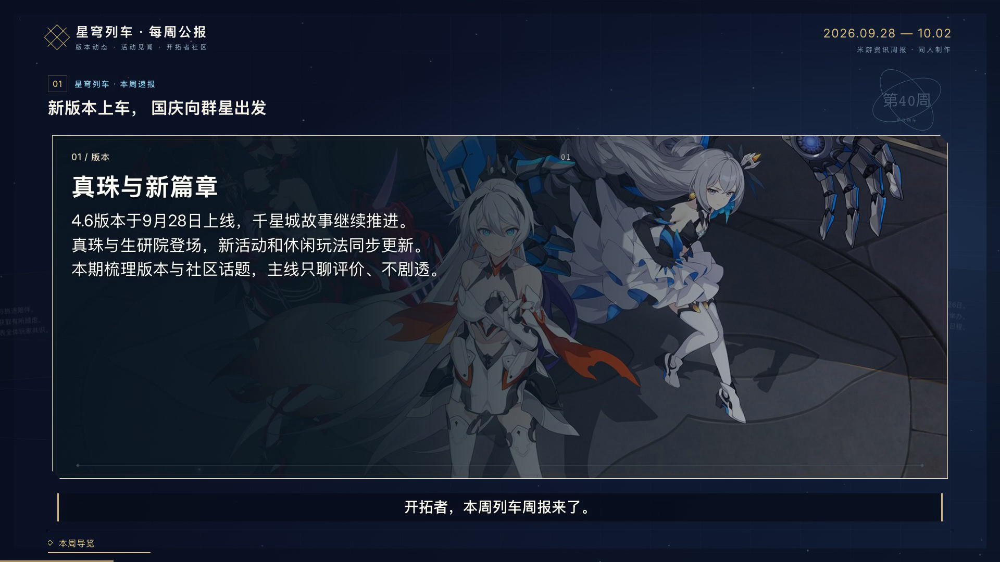

# 当前版本状态：v0.1.0 检查点

当前 Windows 工作目录已整理为 `D:\codex_work\AI创作\miyo_AI_news`，源码和 `voice-library/` 声线参考素材位于同一个项目与 Git 仓库根目录，运行数据继续独立备份。下文的父目录仓库、原工程、Mac 路径、提交标签及数据归档描述保留原机器检查点证据，不代表当前本地已创建相同提交或推送。

记录日期：2026-10-06（Asia/Shanghai）。本次固定的是 **miyo_AI_news 整合工作台、手动配图、可独立调整卡片尺寸** 的版本。

Git 检查点：`miyo-ai-news-v0.1.0-checkpoint-20261006`。项目在父目录 `AI创作` 的 Git 仓库中，以 `miyo_AI_news/` 子目录提交。原工程 `miyo-news-card` 仍保留在 `a11a118` 基线，此次未修改。源码版本号为 `0.1.0`，项目数据结构版本为 `schemaVersion: 1`。

## 可以从哪里继续

- 日常制作流程：[详细使用指南](USER_GUIDE.md)。
- 启动、迁移、备份与故障处理：[运行与维护](OPERATIONS.md)。
- 项目入口：`http://127.0.0.1:3002`。
- 完整历史周报：项目「星铁周报 · 原版导入」，ID `starrail-demo`，当前 v3。
- 最新尺寸样片：项目「星铁大卡预览 · 自定义卡片尺寸」，ID `1e31cd71-9275-4fbf-a4cf-97350b789cbb`，当前 v7。

Git 标签固定源码与文档；本次数据归档固定编辑内容、图片素材、音轨、成片、任务及验证证据。只切换 Git 版本不会把 `data/` 一并回退。

## 当前已实现

| 区域 | 当前行为 |
| --- | --- |
| 制作工作台 | 左侧分镜列表、中间同步预览与时间轴、右侧卡片编辑；新建、复制、手动保存与版本冲突提示 |
| 资料 | 公开网页提取或粘贴；来源链接、发布方、日期、核对状态；来源与分镜关联 |
| 分镜 | 规则整理草稿，手工编辑口播和卡片，增删与排序；卡片与口播分别保存 |
| 手动配图 | 每卡一图；静态 PNG/JPEG/WebP；上传、拖入、素材库复用，左图/右图/背景三布局，填充与位置控制 |
| 卡片尺寸 | 每卡独立宽高，滑杆及整数输入，即时预览、恢复默认；宽800–1720、高360–660，单位为1080p画布像素 |
| 画面布局 | 隐去信息来源行、分镜副标题、底部资料日期和播放时间；扩大中间卡片，保留主标题、字幕、章节及进度线 |
| 四种风格 | 原神旅行手记、崩坏3女武神档案、星铁列车公报、绝区零录像频道；具有不同粒子与动效 |
| 转场 | 五种卡片聚焦切换，以及分镜之间的章节幕切；星铁金色斜向车票横扫保留 |
| 配音 | 默认「琪亚娜-稳重轻角色感-v2-轻角色-基准」1.1倍速；晓晓可选；分镜试听、整期合成、原速缓存复用 |
| 预览 | 实际音频驱动画面与字幕；无有效音轨时显示估算状态；卡片尺寸调整保持当前播放位置 |
| 导出 | 串行后台任务、不可变输入快照、取消与重试、视频下载、逐帧渲染及媒体检查；1080p/24fps/H.264+AAC |
| 数据保护 | 原图不重编码覆盖，配图和尺寸修改不触发口播失效；历史输出不被新任务覆盖 |

卡片默认尺寸按卡位略有区别，首卡通常为1440×620；旧 `cardScale` 仅参与未指定尺寸的兼容计算。显式设置的宽高就是最终尺寸。配音声线、语速、口播或分镜顺序变化会影响音轨有效性；图片、尺寸、正文和视觉风格等纯画面变化可复用有效音轨。

## 本地项目状态

以下是 2026-10-06 13:25 数据快照，不代表以后每次打开的最新状态。

| 项目 | revision | 分镜 / 卡片 | 已配图卡片 | 自定义尺寸卡片 | 用途 |
| --- | --- | --- | --- | --- | --- |
| 星铁周报 · 原版导入 | 3 | 13 / 39 | 1 | 0 | 完整历史周报，含用户手动背景图 |
| 星铁大卡预览 · 自定义卡片尺寸 | 7 | 1 / 3 | 1 | 2 | 当前大卡布局验收样例 |
| 星铁配图预览 · 三种图文布局 | 8 | 1 / 3 | 3 | 0 | 左图、右图、背景图验证 |
| UI 回归验证 · 星铁副本 | 8 | 14 / 40 | 0 | 0 | 工作台回归；当前选用原神主题 |
| 验证用 · 运行中取消与恢复 20261006-105259 | 2 | 1 / 3 | 0 | 0 | 任务取消与重试验证 |

`revision` 用于当前项目保存与冲突校验，不是逐次保存历史库。普通保存会更新项目 JSON；生成任务的 `project.json` 快照和单独备份才保留具体历史内容。

完整 ID、任务终态与备份摘要见 [机器可读状态清单](checkpoints/2026-10-06-state.json)。备份时共5个项目、9个任务，无排队或运行中的任务。

## 成片与验证边界

| 产物 | 任务 ID | 验证结果 |
| --- | --- | --- |
| 最新大卡片样片 | `ef990ec8-822e-43ab-b966-c9741ffee3b2` | 尺寸副本v7；17.6303125秒、424帧；1/1图片解码；无正文溢出或页面错误；完整解码通过 |
| 三种配图布局样片 | `aebdd2bc-35f8-4b2e-8699-002e6b8a32d8` | 配图副本v8；17.6303125秒；3/3图片解码；完整解码通过 |
| 首版完整周报 | `f32fb07f-1b73-47e3-9066-0116e4ef6a96` | 原版v1；约4分17秒，13分镜；完整解码通过；属于大卡/配图改动前的版本 |

文件均在 `data/runs/<任务ID>/video.mp4`。最新尺寸样片第一张卡为1720×660、第二张默认1390×638、第三张1550×600。当前完整项目v3尚未按最新大卡布局重导出完整长片，不应把首版长片当成当前效果。其他三种主题完成渲染检查与静帧检查，未分别输出完整4分钟视频。



截至原 Mac 交付检查点，该环境的最近一轮 `npm test` 共47项通过，`npm run typecheck` 和独立 `.next-build` 生产构建通过。此前配音专项5项通过，并有新琪亚娜和晓晓短句真实输出记录。本次提交固定此前已实现的整合工程，以及新增文档、截图和备份说明；本轮收尾没有重复调用TTS或重导出视频。当前 Windows 单仓库整理结果及原机器历史验收分别记录在 [VERIFICATION.md](VERIFICATION.md)。

## 当前限制

- 历史新闻素材日期为2026-09-28至2026-10-02，不是自动更新的本周资讯。
- 资料整理采用规则分段，尚无全网自动搜索、事实核验或LLM改写；需要人工编辑和核对。
- 不同主题只改变画面与动效，不会自动改写游戏新闻。
- 新口播字幕按语义和邻近静音估算，没有ASR强制对齐，也没有逐条字幕时码编辑器。
- 一卡一图，暂不支持视频配图、动态图、自由拖拽图层或永久删除素材。
- 固定横版1080p/24fps；单机单用户，最多40分镜、每场1–6卡、最长30分钟。
- 小尺寸与长正文可能冲突；导出会检查正文溢出，必要时需拆卡、缩短正文或扩大卡片。
- 正常取消和重试已验证；断电、强杀、跨机器安装、完整主观听评未验收。
- 没有自动发布、多人协作、每次编辑自动保存或数据自动备份。

## 数据快照与恢复定位

本次完整数据归档保存在：

```text
miyo_AI_news/backups/20261006-132529/
├── miyo_AI_news-data.tar.gz
├── manifest.json
└── SHA256SUMS
```

归档字节数：`387447948`（约369.5 MiB）。包含469个文件，原始合计480871878字节。归档前后逐文件SHA-256清单一致，归档内每个文件的大小及SHA-256也与原文件一致。

```text
1799429b1fe5dbab2e49cf910666113d37df3f51a0d2a6523f1fe3db24a1ec32  miyo_AI_news-data.tar.gz
```

`data/` 和 `backups/` 均在 `.gitignore` 中。Git提交包括工程源码、锁文件、历史样例、文档、两张说明截图和状态摘要；大体积运行数据由上述归档保存。归档没有包含工程外的声线库、Python环境和模型，跨机器迁移仍需按 [OPERATIONS.md](OPERATIONS.md) 准备。

恢复时先保留现有工作，再把归档解压到新的空目录校验，确认目标后切换数据目录。不要直接把历史归档覆盖到正在使用的 `data/` 中。后续继续试验时优先在工作台复制项目，源工程代码继续在本检查点之后演进。
